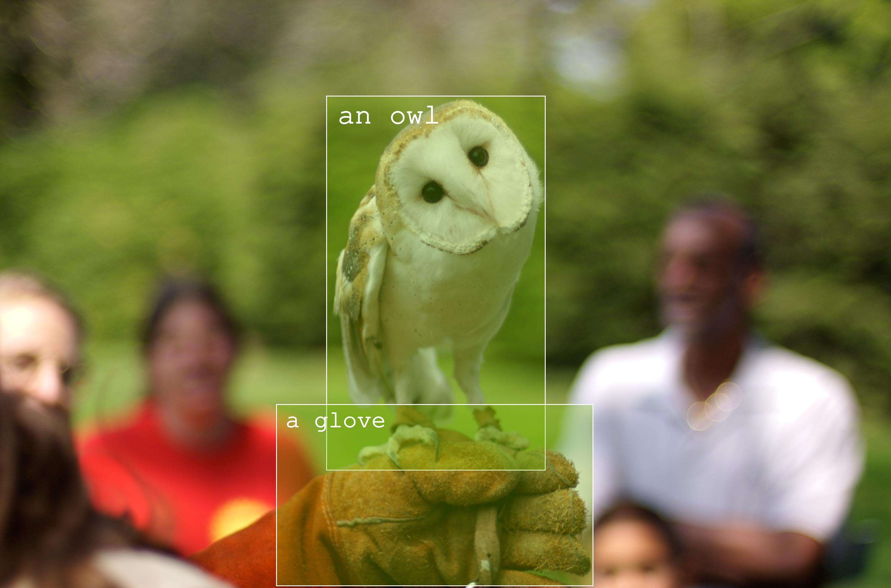
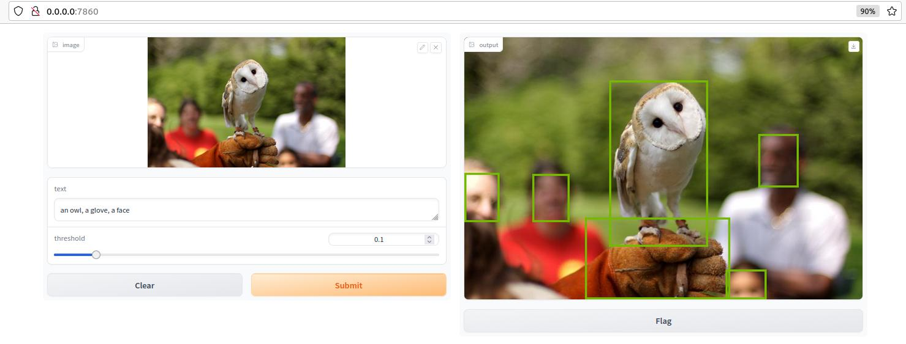

<h1 align="center">NanoOWL</h1>

<p align="center"><a href="#usage"/>👍 Usage</a> - <a href="#performance"/>⏱️ Performance</a> - <a href="#setup">🛠️ Setup</a> - <a href="#examples">🤸 Examples</a> <br> - <a href="#acknowledgement">👏 Acknowledgment</a> - <a href="#see-also">🔗 See also</a></p>

NanoOWL is a project that optimizes [OWL-ViT](https://huggingface.co/docs/transformers/model_doc/owlvit) to run 🔥 ***real-time*** 🔥 on [NVIDIA Jetson AGX Orin](https://store.nvidia.com/en-us/jetson/store) with [NVIDIA TensorRT](https://developer.nvidia.com/tensorrt).  

<p align="center"></p>

> Interested in detecting object masks as well?  Try combining NanoOWL with
> [NanoSAM](https://github.com/NVIDIA-AI-IOT/nanosam) for zero-shot open-vocabulary 
> instance segmentation.

<a id="usage"></a>
## 👍 Usage

You can use NanoOWL in Python like this

```python3
from nanoowl.utils.predictor import OwlVitPredictor

predictor = OwlVitPredictor(
    image_encoder_engine="data/owlvit-base-patch32-image-encoder.engine",
    tresh=0.1
)

image = PIL.Image.open("assets/owl_glove_small.jpg")

detections = predictor.predict(image=image, texts=["an owl", "a glove"], threshold=0.1)

print(detections)
```

<a id="performance"></a>
## ⏱️ Performance

NanoOWL runs real-time on Jetson Orin Nano.

<table style="border-top: solid 1px; border-left: solid 1px; border-right: solid 1px; border-bottom: solid 1px">
    <thead>
        <tr>
            <th rowspan=1 style="text-align: center; border-right: solid 1px">Model †</th>
            <th colspan=1 style="text-align: center; border-right: solid 1px">Image Size</th>
            <th colspan=1 style="text-align: center; border-right: solid 1px">Patch Size</th>
            <th colspan=1 style="text-align: center; border-right: solid 1px">⏱️ Jetson Orin Nano (FPS)</th>
            <th colspan=1 style="text-align: center; border-right: solid 1px">⏱️ Jetson AGX Orin (FPS)</th>
            <th colspan=1 style="text-align: center; border-right: solid 1px">🎯 Accuracy (mAP)</th>
        </tr>
    </thead>
    <tbody>
        <tr>
            <td style="text-align: center; border-right: solid 1px">OWL-ViT (ViT-B/32)</td>
            <td style="text-align: center; border-right: solid 1px">768</td>
            <td style="text-align: center; border-right: solid 1px">32</td>
            <td style="text-align: center; border-right: solid 1px">TBD</td>
            <td style="text-align: center; border-right: solid 1px">95</td>
            <td style="text-align: center; border-right: solid 1px">28</td>
        </tr>
        <tr>
            <td style="text-align: center; border-right: solid 1px">OWL-ViT (ViT-B/16)</td>
            <td style="text-align: center; border-right: solid 1px">768</td>
            <td style="text-align: center; border-right: solid 1px">16</td>
            <td style="text-align: center; border-right: solid 1px">TBD</td>
            <td style="text-align: center; border-right: solid 1px">25</td>
            <td style="text-align: center; border-right: solid 1px">31.7</td>
        </tr>
    </tbody>
</table>

<a id="setup"></a>
## 🛠️ Setup

1. Install the dependencies

    1. Install PyTorch

    2. Install [torch2trt](https://github.com/NVIDIA-AI-IOT/torch2trt)
    3. Install NVIDIA TensorRT
    4. Install the Transformers library

        ```bash
        python3 -m pip install transformers
        ```
    5. (optional) Install NanoSAM (for the instance segmentation example)

2. Install the NanoOWL package.

    ```bash
    git clone https://github.com/NVIDIA-AI-IOT/nanoowl
    cd nanoowl
    python3 setup.py develop --user
    ```

3. Build the TensorRT engine for the OWL-ViT vision encoder

    ```bash
    python3 -m nanoowl.tools.build_trt \
        --model="google/owlvit-base-patch32" \
        --image_encoder_engine="data/owlvit-base-patch32-image-encoder.engine"
    ```
    

4. Run the basic usage example to ensure everything is working

    ```bash
    python3 -m nanoowl.tools.predict \
        --image="assets/owl_glove_small.jpg" \
        --text="an owl" \
        --model="google/owlvit-base-patch32" \
        --image_encoder_engine="data/owlvit-base-patch32-image-encoder.engine" \
        --threshold=0.1 \
        --output_path="data/predict_out.jpg"
    ```

That's it!  If everything is working properly, you should see a visualization saved to ``data/predict_out.jpg``.  

<a id="examples"></a>
## 🤸 Examples

### Example 1 - Gradio Demo



```bash
python3 examples/gradio_demo.py \
    --model="google/owlvit-base-patch32" \
    --image_encoder_engine="data/owlvit-base-patch32-image-encoder.engine" \
    --port=7860
```

### Example 2 - Live Camera

<!--  -->

```bash
python3 examples/live_camera.py \
    --text="a toy robot" \
    --model="google/owlvit-base-patch32" \
    --image_encoder_engine="data/owlvit-base-patch32-image-encoder.engine" \
    --camera_device=0 \
    --threshold=0.1
```

<a id="acknowledgement"></a>
## 👏 Acknowledgement

Thanks to the authors of [OWL-ViT](https://huggingface.co/docs/transformers/model_doc/owlvit) for the great open-vocabluary detection work.

<a id="see-also"></a>
## 🔗 See also

- [NanoSAM](https://github.com/NVIDIA-AI-IOT/nanosam) - A real-time Segment Anything (SAM) model variant for NVIDIA Jetson Orin platforms.
- [Jetson Introduction to Knowledge Distillation Tutorial](https://github.com/NVIDIA-AI-IOT/jetson-intro-to-distillation) - For an introduction to knowledge distillation as a model optimization technique.
- [Jetson Generative AI Playground](https://nvidia-ai-iot.github.io/jetson-generative-ai-playground/) - For instructions and tips for using a variety of LLMs and transformers on Jetson.
- [Jetson Containers](https://github.com/dusty-nv/jetson-containers) - For a variety of easily deployable and modular Jetson Containers
